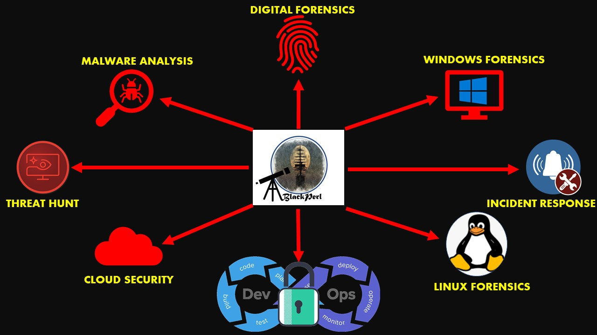

# What is Davy-Jones-Locker ?
Getting FREE Cyber Security Resources have been a challenge always. Access Davy-Jones-Locker to get all what you might need to upskill yourself and create an impact in the InfoSec Community.
* In return get me some subscribers for my YouTube Channel👉 https://www.youtube.com/c/BlackPerl
* If you like to support my creation and pay me back a little, you can buy me a coffee ☕ https://www.buymeacoffee.com/BlackPerl

  

# CATEGORIES
  1. [YouTube Channels](#YouTube-Channels)
  2. [Links to Remember](#Links)
  3. [Twitter Handle to Follow](#Twitter-Handles)
  4. [Conferences](#conferences)
  5. [Instructor Led Webinar & Workshops](#Instructor-Led-Webinar-&-Workshops)
  6. [Training](#Training)
  7. [References-Tools](#References-Tools)
  8. [The Ultimate List of Cheet-Sheets](#The-Ultimate-List-of-CheatSheets)
  9. [DFIR PODCasts](#DFIR-PODCasts)

## YouTube-Channels
*   **BlackPerl** - From the Owner (Which is me 🤣)BlackPerl is here to help you AMPLIFY your CYBER SECURITY knowledge. It's not JUST about general knowledge, but I'll go and deep dive in some areas for INCIDENT RESPONSE, DIGITAL FORENSICS Fundamental Ideas, Process overview, and how someone can really get deeper ideas around them.  I'll try to discuss my real world experience around DFIR to help you to improve our skills. Since KNOWLEDGE grows by sharing, my whole intention is to share our real life experiences while we're working on different INFOSEC fields to help all to get in depth. Access the Channel Here- https://www.youtube.com/c/BlackPerl

  

*   **SimplyCyber** - The Channel is maintained by Geral Auger and he creates really awesome content for InfoSec to help IT or Information Security professionals take their career further, faster. There have been a Collab done with BlackPerl + Simply-Cyber. Access that Episode here- https://youtu.be/gfX6GqGN9Uw

*   **HackADay** - Hackaday serves up Fresh Hacks Every Day from around the Internet. https://hackaday.com/

*	**TheCyberMentor** - Heath Adams uploads regular videos related to various facets of cyber security, from bug bounty hunts to specific pentest methodologies like API, buffer overflows, networking. https://www.youtube.com/c/TheCyberMentor/

*	**Grant Collins** - Grant uploads videos regarding breaking into cybersecurity, various cybersecurity projects, building up a home lab amongst many others. Also has a companion discord channel and a resource website. https://www.youtube.com/channel/UCTLUi3oc1-a7dS-2-YgEKmA/featured

*	**DedSec** - lots of brief screenshot how-to vids based in Kali, no recent posts. https://www.youtube.com/channel/UCx34ZZW2KgezfUPPeL6m8Dw
	
*	**danooct1** - lots of brief screenshot, how-to vids regarding malware, regular content updates, 186K followers https://www.youtube.com/channel/UCqbkm47qBxDj-P3lI9voIAw
	
*	**BalCCon** - Balkan Computer Congress - Long con-style talks from the Balkan Computer Congress, doesn’t update regularlyhttps://www.youtube.com/channel/UCoHypmu8rxlB5Axh5JxFZsA

*	**Corey Nachreiner** - security newsbites, 2.7K subscribers, 2-3 videos a week, no set schedule https://www.youtube.com/channel/UC7dUL0FbVPGqzdb2HtWw3Xg

*	**Adrian Crenshaw** - lots of lengthy con-style talks https://www.youtube.com/user/irongeek

*	**0x41414141** - Channel with couple challenges, well explained https://www.youtube.com/channel/UCPqes566OZ3G_fjxL6BngRQ

*	**GynvaelEN** - Security streams from Google Researcher. Mainly about CTFs, computer security, programing and similar things. https://www.youtube.com/channel/UCCkVMojdBWS-JtH7TliWkVg
	
*	**Geeks Fort** - KIF - lots of brief screenshot vids, no recent posts  https://www.youtube.com/channel/UC09NdTL2hkThGLSab8chJMw
	
*	**Error 404 Cyber News** - short screen-shot videos with loud metal, no dialog, bi-weekly https://www.youtube.com/channel/UC4HcNHFKshqj-aeyi6imW7Q
	
*	**Don Does 30** - amateur pen-tester posting lots of brief screenshot vids regularly, 9K Followers https://www.youtube.com/channel/UCarxjDjSYsIf50Jm73V1D7g
	
*	**Derek Rook** - CTF/Boot2root/wargames Walkthrough - lots of lengthy screenshot instructional vids, https://www.youtube.com/channel/UCMACXuWd2w6_IEGog744UaA
	
*	**DemmSec** - lots of pen testing vids, somewhat irregular uploads, 44K followers https://www.youtube.com/channel/UCJItQmwUrcW4VdUqWaRUNIg
	
*	**DEFCON Conference** - lots of lengthy con-style vids from the iconical DEFCON https://www.youtube.com/channel/UC6Om9kAkl32dWlDSNlDS9Iw

*	**Pentester Academy TV** - lots of brief videos, very regular posting, up to +8 a week https://www.youtube.com/channel/UChjC1q6Ami7W0E71TzPZELA
	
*	**Open SecurityTraining** - lots of lengthy lecture-style vids, no recent posts, but quality info. https://www.youtube.com/channel/UCthV50MozQIfawL9a_g5rdg
	
*	**NetSecNow** - channel of pentesteruniversity.org, seems to post once a month, screenshot instructional vids
	 https://www.youtube.com/channel/UC6J_GnSAi7F2hY4RmnMcWJw
	
*	**Metasploitation** - lots of screenshot vids, little to no dialogue, all about using Metasploit, no recent vids. https://www.youtube.com/channel/UC9Qa_gXarSmObPX3ooIQZrg
	
*	**LiveOverflow** - Lots of brief-to-medium instructional vids, covering things like buffer overflows and exploit writing, regular posts. https://www.youtube.com/channel/UClcE-kVhqyiHCcjYwcpfj9w
	
*	**LionSec** - lots of brief screenshot instructional vids, no dialog https://www.youtube.com/channel/UCCQLBOt_hbGE-b9I696VRow
	
*	**Latest Hacking News** 10K followers, medium length screenshot videos, no recent releases https://www.youtube.com/user/thefieldhouse/feed
	
*	**John Hammond** - Solves CTF problems. contains penTesting tips and tricks https://www.youtube.com/user/RootOfTheNull
	
*	**JackkTutorials** - lots of medium length instructional vids with some AskMe vids from the youtuber https://www.youtube.com/channel/UC64x_rKHxY113KMWmprLBPA
	
*	**iExplo1t** - lots of screenshot vids aimed at novices, 5.7K Followers, no recent posts https://www.youtube.com/channel/UCx0HClQ_cv0sLNOVhoO2nxg/videos
	
*	**HACKING TUTORIALS** - handful of brief screenshot vids, no recent posts. https://www.youtube.com/channel/UCbsn2kQwNxcIzHwbdDjzehA
	
*	**HackerSploit** - regular posts, medium length screenshot vids, with dialog https://www.youtube.com/channel/UC0ZTPkdxlAKf-V33tqXwi3Q

*	**IPPSec** https://www.youtube.com/channel/UCa6eh7gCkpPo5XXUDfygQQA
	
*	**Tradecraft Security Weekly** - Want to learn about all of the latest security tools and techniques?
	https://wiki.securityweekly.com/Tradecraft_Security_Weekly
	
*	**Derek Rook** - CTF/Boot2root/wargames Walkthrough - lots of lengthy screenshot instructional vids https://www.youtube.com/channel/UCMACXuWd2w6_IEGog744UaA

*	**Adrian Crenshaw** - lots of lengthy con-style talks https://www.youtube.com/user/irongeek
	
*	**LionSec** - lots of brief screenshot instructional vids, no dialog https://www.youtube.com/channel/UCCQLBOt_hbGE-b9I696VRow
	
*	**Zer0Mem0ry** - lots of brief c++ security videos, programming intensive
	https://www.youtube.com/channel/UCDk155eaoariJF2Dn2j5WKA
	
*	**webpwnized** - lots of brief screenshot vids, some CTF walkthroughs https://www.youtube.com/channel/UCPeJcqbi8v46Adk59plaaXg
	
*	**Waleed Jutt** - lots of brief screenshot vids covering web security and game programming https://www.youtube.com/channel/UCeN7cOELsyMHrzfMsJUgv3Q
	
*	**Troy Hunt** - lone youtuber, medium length news videos, 16K followers, regular content https://www.youtube.com/channel/UCD6MWz4A61JaeGrvyoYl-rQ
	
*	**Tradecraft Security Weekly** - Want to learn about all of the latest security tools and techniques?https://wiki.securityweekly.com/Tradecraft_Security_Weekly
	
*	**SSTec Tutorials** - lots of brief screenshot vids, regular updates https://www.youtube.com/channel/UCHvUTfxL_9bNQgqzekPWHtg
	
*	**Shozab Haxor** - lots of screenshot style instructional vids, regular updates, windows CLI tutorial https://www.youtube.com/channel/UCBwub2kRoercWQJ2mw82h3A
	
*	**Seytonic** - variety of DIY hacking tutorials, hardware hacks, regular updates https://www.youtube.com/channel/UCW6xlqxSY3gGur4PkGPEUeA
	
*	**Security Weekly** - regular updates, lengthy podcast-style interviews with industry pros https://www.youtube.com/channel/UCg--XBjJ50a9tUhTKXVPiqg
	
*	**SecureNinjaTV** - brief news bites, irregular posting, 18K followers https://www.youtube.com/channel/UCNxfV4yR0nIlhFmfwcdf3BQ
	
*	**Samy Kamkar’s Applied hacking** https://www.youtube.com/user/s4myk
	
*	**rwbnetsec** - lots of medium length instructional videos covering tools from Kali 2.0, no recent posts. https://www.youtube.com/channel/UCAJ8Clc3188ek9T_5XTVzZQ
	
*	**Penetration Testing in Linux** https://www.youtube.com/channel/UC286ntgASMskhPIJQebJVvA

## Links
### Cyber Security Blog Posts-
* https://cxsecurity.com/
* https://danielmiessler.com/
* https://www.grahamcluley.com/about-this-site/
* https://www.itsecurityguru.org/
* https://securityweekly.com/blog
* https://thehackernews.com/
* https://www.infosecurity-magazine.com/
* https://www.csoonline.com/
* https://www.tripwire.com/state-of-security/
* https://www.troyhunt.com/
* http://lastwatchdog.com/
* https://www.schneier.com/
* https://blogs.akamai.com/
* http://krebsonsecurity.com/
* http://taosecurity.blogspot.ro/
* http://www.darkreading.com/
* http://www.pcworld.com/
* http://www.wired.com/
* http://www.cio.com/
* https://www.cnet.com/
* https://www.welivesecurity.com/
* https://www.afcea.org/content/
* https://threatpost.com/
* http://www.computerworld.com/category/emerging-technology/
* https://threatpost.com/
* https://dankaminsky.com/
* https://www.liquidmatrix.org/blog/
* https://www.schneier.com/
* https://www.grahamcluley.com/
* https://www.hackingarticles.in/
* https://taosecurity.blogspot.com/
* https://securityaffairs.co/wordpress/
* https://dzone.com/cloud-computing-tutorials-tools-news
* https://securityweekly.com/
* https://www.hackread.com/
* https://www.infoq.com/?variant=homepage_collections
* https://www.wired.com/category/threatlevel/
* https://www.bankinfosecurity.in/

### Roundups for DFIR
* https://thisweekin4n6.com/

### Take help from Android/IOS Apps-
*  Cyber Security News by Newsfusion
*  Cyware Social - Cyber Security News by Cyware
*  Hackers News (Tech & Cyber Security News) by Lucifer Corp.
*  Cyber Security News by BT & Partners Group
*  HackerStorm Cyber Security News LITE by HackerStorm

## Twitter-Handles
*  @blackperl_dfir
*  @jatinlibra
*  @hackinarticles
*  @darktracer_int
*  @phillmoore
*  @ICSCERT
*  @ThalesCloudSec
*  @SentinelOne
*  @BushidoToken
*  @fs0c131y
*  @dailydot
*  @thousandeyes
*  @Cyjax_Ltd
*  @cloudsa
*  @DSCI_TiR
*  @threatintelctr
*  @cipherstorm
*  @pulsedive
*  @MBThreatIntel
*  @CtacPaladion
*  @tlsn0085
*  @ThreatCloud
*  @threatintel
*  @MITREattack
*  @CSOCIntel
*  @MaliciousLife
*  @JacksonHHax
*  @secureideas
*  @nullenc0de
*  @malwarelab_eu
*  @sl33tpanth3r
*  @MalwareTechBlog
*  @DarkReading
*  @NCSCgov
*  @cyber

## Conferences
Please follow my LinkedIn Posts to know about the upcoming Conferences. I will try to pin them down here as well.

## Instructor-Led-Webinar-&-Workshops
Please follow my LinkedIn Posts to know about the upcoming Conferences. I will try to pin them down here as well.

## Training

* **Nox Cyber** Jay Jay Davey site full of curated cybersecurity training resources. https://noxcyber.co.uk/

* **Cloud & Technical Traning** This awesome traning is designed and created by Adrian Cantrill. Check out the resource here- https://learn.cantrill.io/

* **Fortinet Security Appliance Training** Free access to the FortiGate Essentials Training Course and Network Security Expert courses 1 and 2 https://www.fortinet.com/training/cybersecurity-professionals.html

* **Chief Information Security Officer (CISO) Workshop Training** - The Chief Information Security Office (CISO) workshop contains a collection of security learnings, principles, and recommendations for modernizing security in your organization. This training workshop is a combination of experiences from Microsoft security teams and learnings from customers. - https://docs.microsoft.com/en-us/security/ciso-workshop/ciso-workshop

* **CLARK Center Plan C** - Free cybersecurity curriculum that is primarily video-based or provide online assignments that can be easily integrated into a virtual learning environments https://clark.center/home

* **Hack.me** is a FREE, community based project powered by eLearnSecurity. The community can build, host and share vulnerable web application code for educational and research purposes. It aims to be the largest collection of "runnable" vulnerable web applications, code samples and CMS's online. The platform is available without any restriction to any party interested in Web Application Security. https://hack.me/

* **Hacker101** - Free classes for web security - https://www.hacker101.com/

* **ElasticStack** - Free on-demand Elastic Stack, observability, and security courses. https://training.elastic.co/learn-from-home

* **Hoppers Roppers** - Community built around a series of free courses that provide training to beginners in the security field. https://www.hoppersroppers.org/training.html

* **IBM Security Learning Academy**	Free technical training for IBM Security products. https://www.securitylearningacademy.com/

* **M.E. Kabay**	Free industry courses and course materials for students, teachers and others are welcome to use for free courses and lectures.	 http://www.mekabay.com/courses/index.htm

* **Open P-TECH**	Free digital learning on the tech skills of tomorrow. https://www.ptech.org/open-p-tech/

* **Udemy** - Online learning course platform "collection from the free courses in our learning marketplace" https://www.udemy.com/courses/free/

* **Enroll Now Free: PCAP Programming Essentials in Python** https://www.netacad.com/courses/programming/pcap-programming-essentials-python Python is the very versatile, object-oriented programming language used by startups and tech giants, Google, Facebook, Dropbox and IBM. Python is also recommended for aspiring young developers who are interested in pursuing careers in Security, Networking and Internet-of-Things. Once you complete this course, you are ready to take the PCAP – Certified Associate in Python programming. No prior knowledge of programming is required. 

* **Packt Web Development Course** Web Development Get to grips with the fundamentals of the modern web Unlock one year of free online access. https://courses.packtpub.com/pages/free?fbclid=IwAR1FtKQcYK8ycCmBMXaBGvW_7SgPVDMKMaRVwXYcSbiwvMfp75gazxRZlzY

* **Stanford University Webinar - Hacked! Security Lessons from Big Name Breaches** 50 minute cyber lecture from Stanford.You Will Learn: -- The root cause of key breaches and how to prevent them; How to measure your organization’s external security posture; How the attacker lifecycle should influence the way you allocate resources https://www.youtube.com/watch?v=V9agUAz0DwI

* **Stanford University Webinar - Hash, Hack, Code: Emerging Trends in Cyber Security** Join Professor Dan Boneh as he shares new approaches to these emerging trends and dives deeper into how you can protect networks and prevent harmful viruses and threats. 50 minute cyber lecture from Stanford. https://www.youtube.com/watch?v=544rhbcDtc8

* **Kill Chain: The Cyber War on America's Elections (Documentary)** (Referenced at GRIMMCON), In advance of the 2020 Presidential Election, Kill Chain: The Cyber War on America’s Elections takes a deep dive into the weaknesses of today’s election technology, an issue that is little understood by the public or even lawmakers. https://www.hbo.com/documentaries/kill-chain-the-cyber-war-on-americas-elections

* **Intro to Cybersecurity Course**  (15 hours) Learn how to protect your personal data and privacy online and in social media, and why more and more IT jobs require cybersecurity awareness and understanding. Receive a certificate of completion. https://www.netacad.com/portal/web/self-enroll/c/course-1003729

* **Cybersecurity Essentials** (30 hours) Foundational knowledge and essential skills for all cybersecurity domains, including info security, systems sec, network sec, ethics and laws, and defense and mitigation techniques used in protecting businesses. https://www.netacad.com/portal/web/self-enroll/c/course-1003733

* **Pluralsight and Microsoft** Partnership to help you become an expert in Azure. With skill assessments and over 200+ courses, 40+ Skill IQs and 8 Role IQs, you can focus your time on understanding your strengths and skill gaps and learn Azure as quickly as possible.https://www.pluralsight.com/partners/microsoft/azure

* **Blackhat Webcast Series** Monthly webcast of varying cyber topics. I will post specific ones in the training section below sometimes, but this is worth bookmarking and checking back. They always have top tier speakers on relevant, current topics. https://www.blackhat.com/html/webcast/webcast-home.html

* **Federal Virtual Training Environment** - US Govt sponsored free courses. There are 6 available, no login required. They are 101 Coding for the Public,  101 Critical Infrastructure Protection for the Public, Cryptocurrency for Law Enforcement for the Public, Cyber Supply Chain Risk Management for the Public, 101 Reverse Engineering for the Public, Fundamentals of Cyber Risk Management. https://fedvte.usalearning.gov/public_fedvte.php

* **Harrisburg University CyberSecurity** Collection of 18 curated talks. Scroll down to CYBER SECURITY section. You will see there are 4 categories Resource Sharing, Tools & Techniques, Red Team (Offensive Security) and Blue Teaming (Defensive Security). Lot of content in here; something for everyone. https://professionaled.harrisburgu.edu/online-content/

* **OnRamp 101-Level ICS Security Workshop** Starts this 4/28.  10 videos, Q&A / discussion, bonus audio, great links. Get up to speed fast on ICS security. It runs for 5 weeks. 2 videos per week. Then we keep it open for another 3 weeks for 8 in total. https://onramp-3.s4xevents.com

* **HackXOR WebApp CTF** Hackxor is a realistic web application hacking game, designed to help players of all abilities develop their skills. All the missions are based on real vulnerabilities I've personally found while doing pentests, bug bounty hunting, and research. https://hackxor.net/

* **Suricata Training** 5-part training module using a simulation as a backdrop to teach how to use Suricata. https://rangeforce.com/resource/suricata-challenge-reg/

* **Linux Journey** A free, handy guide for learning Linux. Coverage begins with the fundamentals of command line navigation and basic text manipulation. It then extends to more advanced topics, such as file systems and networking. The site is well organized and includes many examples along with code snippets. Exercises and quizzes are provided as well. https://linuxjourney.com

* **Ryan's Tutorials** A collection of free, introductory tutorials on several technology topics including: Linux command line, Bash scripting, creating and styling webpages with HTML and CSS, counting and converting between different number systems, and writing regular expressions. https://ryanstutorials.net

* **The Ultimate List of SANS Cheat Sheets** Massive collection of free cybersecurity cheat sheets for quick reference (login with free SANS account required for some penetration testing resources). https://www.sans.org/blog/the-ultimate-list-of-sans-cheat-sheets/

* **CYBER INTELLIGENCE ANALYTICS AND OPERATIONS** Learn:The ins and outs of all stages of the intelligence cycle from collection to analysis from seasoned intel professionals. How to employ threat intelligence to conduct comprehensive defense strategies to mitigate potential compromise. How to use TI to respond to and minimize impact of cyber incidents. How to generate comprehensive and actionable reports to communicate gaps in defenses and intelligence findings to decision makers. https://www.shadowscape.io/cyber-intelligence-analytics-operat

* **Linux Command Line for Beginners** 25 hours of training - In this course, you’ll learn from one of Fullstack’s top instructors, Corey Greenwald, as he guides you through learning the basics of the command line through short, digestible video lectures. Then you’ll use Fullstack’s CyberLab platform to hone your new technical skills while working through a Capture the Flag game, a special kind of cybersecurity game designed to challenge participants to solve computer security problems by solving puzzles. Finally, through a list of carefully curated resources through a series of curated resources, we’ll introduce you to some important cybersecurity topics so that you can understand some of the common language, concepts and tools used in the industry. https://prep.fullstackacademy.com/

* **Hacking 101** 6 hours of free training - First, you'll take a tour of the world and watch videos of hackers in action across various platforms (including computers, smartphones, and the power grid). You may be shocked to learn what techniques the good guys are using to fight the bad guys (and which side is winning). Then you'll learn what it's like to work in this world, as we show you the different career paths open to you and the (significant) income you could make as a cybersecurity professional. https://cyber.fullstackacademy.com/prepare/hacking-101

* **NETINSTRUCT.COM** Free Cybersecurity, IT and Leadership Courses - Includes OS and networking basics. Critical to any Cyber job. https://netinstruct.com/courses

* **HackerSploit** - HackerSploit is the leading provider of free and open-source Infosec and cybersecurity training. https://hackersploit.org/

* **CyberStart America** - "A new program designed to give high school students in the US free access to cybersecurity learning resources written and developed by industry professionals, which can also be used to train and qualify for a National Cyber Scholarship." Sponsored by the SANS Institue and the National Cyber Scholarship Foundation, the program is open to high school students who are at least 13 years old and enrolled in 9th, 10th, 11th or 12th grade at a public or private school (or the homeschool equivalent) in the US. https://www.cyberstartamerica.org

* **WebSecurity Academy** Free online web security training from the creators of Burp Suite https://portswigger.net/web-security

* **Mosse Cyber Security Institute** Introduction to cybersecurity free certification with 100+ hours of training, no expiry/renewals, https://www.mosse-institute.com/certifications/mics-introduction-to-cyber-security.html

* **BugCrowd University** Free bug hunting resources and methodologies in form of webinars, education and training. https://www.bugcrowd.com/hackers/bugcrowd-university/

* **Certified Network Security Specialist** Certification and training; Expires Aug 31 2020 Use coupon code #StaySafeHome during checkout to claim your free access. Offer is valid till 31/08/2020.  £500.00 Value https://www.icsi.co.uk/courses/icsi-cnss-certified-network-security-specialist-covid-19

*	**Metasploit Unleashed**	Most complete and in-depth Metasploit guide available, with contributions from the authors of the No Starch Press Metasploit Book. 	https://www.offensive-security.com/metasploit-unleashed/

*	**AWS Cloud Certified**	Get skills in AWS to be more marketable. Training is quality and free.	https://www.youtube.com/watch?v=3hLmDS179YE Have to create an AWS account, Exam is $100.

*	**SANS Faculty Free Tools	List of OSS** developed by SANS staff.	https://www.sans.org/media/free/free-faculty-tools.pdf?msc=sans-free-lp

* **"Using ATT&CK for Cyber Threat Intelligence Training"** - 4 hour training The goal of this training is for students to understand the following:  at:  https://attack.mitre.org/resources/training/cti/

* **Coursera** -"Coursera Together: Free online learning during COVID-19" Lots of different types of free training. https://blog.coursera.org/coursera-together-free-online-learning-during-covid-19/

* **flAWS System** Through a series of levels you'll learn about common mistakes and gotchas when using Amazon Web Services (AWS). Multiple levels, "Buckets" of fun. http://flaws.cloud/ 

* **Stanford CS 253 Web Security** A free course from Stanford providing a comprehensive overview of web security. The course begins with an introduction to the fundamentals of web security and proceeds to discuss the most common methods for web attacks and their countermeasures. The course includes video lectures, slides, and links to online reading assignments. https://web.stanford.edu/class/cs253

## References-Tools

* VT- https://www.virustotal.com/gui/
* IPVoid- https://www.ipvoid.com/
* URL Void- https://www.urlvoid.com/
* Abuse IPDB- https://www.abuseipdb.com/
* MX Lookup- https://mxtoolbox.com/
* URL Sandbox- https://urlscan.io/
* Open Sandbox- https://www.hybrid-analysis.com/
* TI Search Engine- https://maltiverse.com/search
* IP Details- https://bgp.he.net/
* Joe Sandbox- https://www.joesandbox.com/
* IP Address Lookup- http://whatismyipaddress.com/ip-lookup

* Align Vault Lookup- https://otx.alienvault.com/browse/global?sort=created&include_inactive=0&page=1&indicatorsSearch=
* Hash lookup- https://totalhash.cymru.com/

* Dan’s tool- https://www.url-encode-decode.com/base64-encode-decode/

* Code Decode/Encoder- https://www.browserling.com/tools/utf16-encode

* Script converter- https://www.freeformatter.com/javascript-beautifier.html#ad-output

* Online Diagram creator- https://app.diagrams.net/
* ThreatCrowd- https://www.threatcrowd.org/

* Malware Analysis Sanboxes- https://redteamer.medium.com/15-online-sandboxes-for-malware-analysis-f8885ecb8a35

* Malware URL Exchange- https://urlhaus.abuse.ch/
* Check pwned credentials Reports- https://haveibeenpwned.com/

## The-Ultimate-List-of-CheatSheets

### General IT Security
* Windows and Linux Terminals & Command Lines - https://assets.contentstack.io/v3/assets/blt36c2e63521272fdc/bltea7de5267932e94b/5eb08aafcf88d36e47cf0644/Cheatsheet_SEC301-401_R7.pdf
* TCP/IP and tcpdump- https://www.sans.org/security-resources/tcpip.pdf?msc=Cheat+Sheet+Blog
* IPv6 Pocket Guide- https://www.sans.org/security-resources/ipv6_tcpip_pocketguide.pdf?msc=Cheat+Sheet+Blog
* Powershell Cheat Sheet- https://assets.contentstack.io/v3/assets/blt36c2e63521272fdc/bltf146e4f361db3938/5e34a7bc946d717e2eab6139/power-shell-cheat-sheet-v41.pdf?msc=Cheat+Sheet+Blog
* Writing Tips for IT Professionals- https://zeltser.com/media/docs/writing-tips-for-it-professionals.pdf
* Tips for Creating and Managing New IT Products- https://zeltser.com/media/docs/new-product-management-tips.pdf?msc=Cheat+Sheet+Blog
* Tips for Getting the Right IT Job- https://zeltser.com/media/docs/getting-the-right-it-job-tips.pdf?msc=Cheat+Sheet+Blog
* Tips for Creating a Strong Cybersecurity Assessment Report- https://zeltser.com/media/docs/security-assessment-report-cheat-sheet.pdf?msc=Cheat+Sheet+Blog
* Critical Log Review Checklist for Security Incidents- https://www.sans.org/brochure/course/log-management-in-depth/6?msc=Cheat+Sheet+Blog
* Security Architecture Cheat Sheet for Internet Applications- https://zeltser.com/media/docs/security-architecture-cheat-sheet.pdf?msc=Cheat+Sheet+Blog
* Tips for Troubleshooting Human Communications- https://zeltser.com/human-communications-cheat-sheet/?msc=Cheat+Sheet+Blog
* Security Incident Survey Cheat Sheet for Server Administrators- https://zeltser.com/media/docs/security-incident-survey-cheat-sheet.pdf?msc=Cheat+Sheet+Blog
* Network DDoS Incident Response Cheat Sheet- https://zeltser.com/media/docs/ddos-incident-cheat-sheet.pdf?msc=Cheat+Sheet+Blog
* Information Security Assessment RFP Cheat Sheet- https://zeltser.com/media/docs/security-assessment-rfp-cheat-sheet.pdf?msc=Cheat+Sheet+Blog
* Python 3 Essentials- https://www.sans.org/blog/sans-cheat-sheet-python-3/?msc=Cheat+Sheet+Blog

### Digital Forensics and Incident Response
* JSON and jq Quick Start Guide- https://digital-forensics.sans.org/media/FOR572HANDOUT_jq_v1.2.pdf?msc=Cheat+Sheet+Blog&_ga=2.159686133.975788839.1616414347-1472635969.1601276132
* SIFT Workstation Cheat Sheet- https://digital-forensics.sans.org/media/sift_cheat_sheet.pdf?msc=Cheat+Sheet+Blog&_ga=2.159686133.975788839.1616414347-1472635969.1601276132
* Tips for Reverse-Engineering Malicious Code- https://digital-forensics.sans.org/media/sift_cheat_sheet.pdf?msc=Cheat+Sheet+Blog&_ga=2.159686133.975788839.1616414347-1472635969.1601276132
* REMnux Usage Tips for Malware Analysis on Linux- https://digital-forensics.sans.org/media/remnux-malware-analysis-tips.pdf?msc=Cheat+Sheet+Blog&_ga=2.159686133.975788839.1616414347-1472635969.1601276132
* Analyzing Malicious Documents- https://digital-forensics.sans.org/media/analyzing-malicious-document-files.pdf?msc=Cheat+Sheet+Blog&_ga=2.159686133.975788839.1616414347-1472635969.1601276132
* Malware Analysis and Reverse-Engineering Cheat Sheet- https://digital-forensics.sans.org/media/malware-analysis-cheat-sheet.pdf?msc=Cheat+Sheet+Blog&_ga=2.159686133.975788839.1616414347-1472635969.1601276132
* SQlite Pocket Reference Guide- https://digital-forensics.sans.org/media/SQlite-PocketReference-final.pdf?msc=Cheat+Sheet+Blog&_ga=2.159686133.975788839.1616414347-1472635969.1601276132
* Eric Zimmerman's tools Cheat Sheet- https://digital-forensics.sans.org/media/EricZimmermanCommandLineToolsCheatSheet-v1.0.pdf?msc=Cheat+Sheet+Blog&_ga=2.108705226.975788839.1616414347-1472635969.1601276132
* Rekall Memory Forensics Cheat Sheet- https://digital-forensics.sans.org/media/rekall-memory-forensics-cheatsheet.pdf?msc=Cheat+Sheet+Blog&_ga=2.108705226.975788839.1616414347-1472635969.1601276132
* Linux Shell Survival Guide- https://digital-forensics.sans.org/media/linux-shell-survival-guide.pdf?msc=Cheat+Sheet+Blog&_ga=2.108705226.975788839.1616414347-1472635969.1601276132
* Windows to Unix Cheat Sheet- https://digital-forensics.sans.org/media/windows_to_unix_cheatsheet.pdf?msc=Cheat+Sheet+Blog&_ga=2.108705226.975788839.1616414347-1472635969.1601276132
* Memory Forensics Cheat Sheet- https://digital-forensics.sans.org/media/volatility-memory-forensics-cheat-sheet.pdf?msc=Cheat+Sheet+Blog&_ga=2.108705226.975788839.1616414347-1472635969.1601276132
* Hex and Regex Forensics Cheat Sheet- https://digital-forensics.sans.org/media/hex_file_and_regex_cheat_sheet.pdf?msc=Cheat+Sheet+Blog&_ga=2.108705226.975788839.1616414347-1472635969.1601276132
* FOR518 Mac & iOS HFS+ Filesystem Reference Sheet- https://assets.contentstack.io/v3/assets/blt36c2e63521272fdc/blt61c336e02577e733/5eb0940e248a28605479ccf0/FOR518_APFS_CheatSheet_012020.pdf
* iOS Third-Party Apps Forensics Reference Guide Poster- https://www.sans.org/security-resources/posters/dfir/ios-third-party-apps-forensics-reference-guide-poster-300?msc=Cheat+Sheet+Blog

### SANS Community Cheat Sheets

* https://www.sans.org/security-resources/posters/dfir/ios-third-party-apps-forensics-reference-guide-poster-300?msc=Cheat+Sheet+Blog

### Cloud Security

* Multicloud Cheat Sheet- https://www.sans.org/security-resources/posters/cloud/multicloud-cheat-sheet-215?msc=blog-ultimate-list-cheat-sheets
* Cloud Security and DevOps Cheat Sheet- https://www.sans.org/security-resources/posters/cloud/cloud-security-devops-cheat-sheet-270

## DFIR-PODCasts

* The Digital Forensics Files Podcast- https://anchor.fm/dfiforensics
